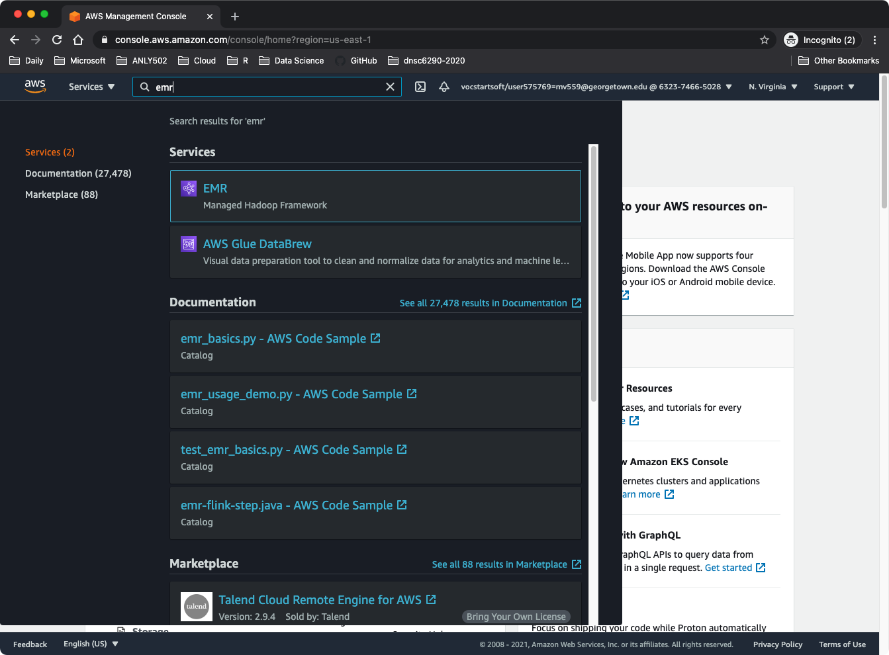
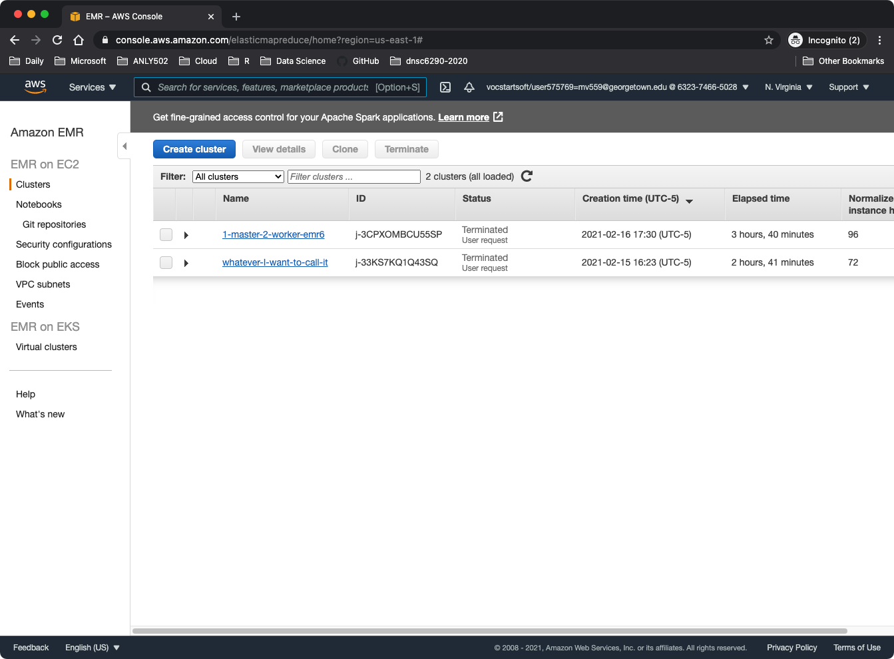
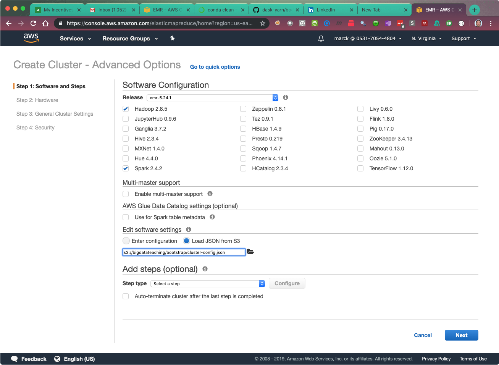
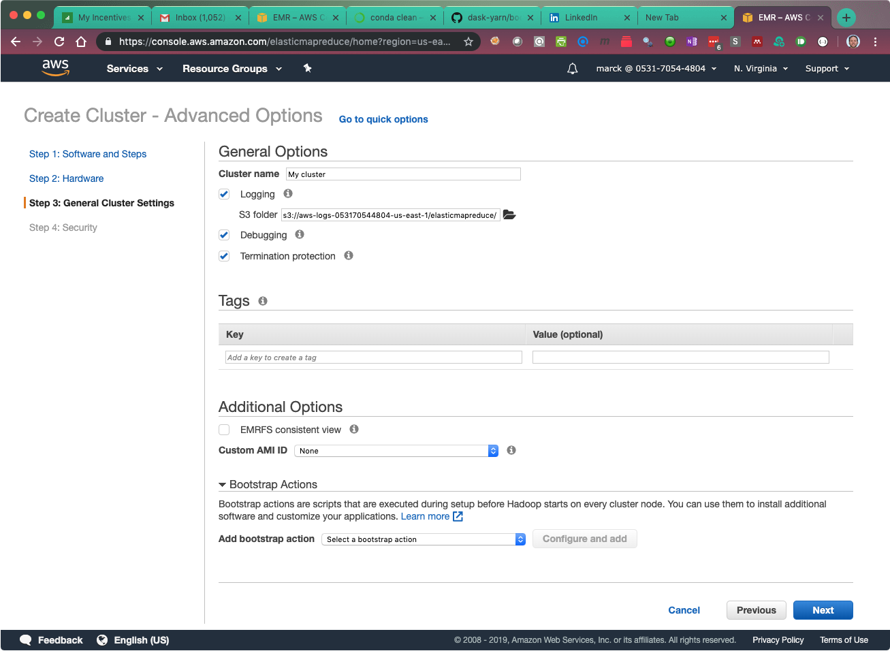
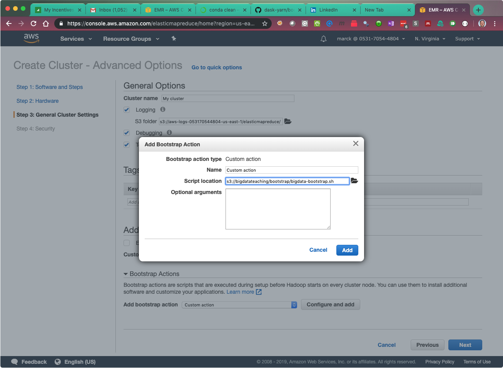
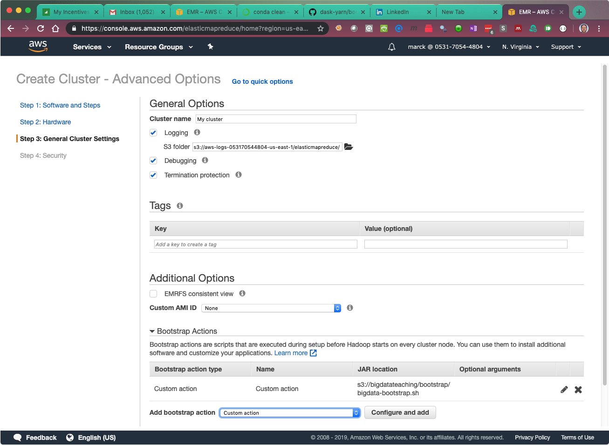
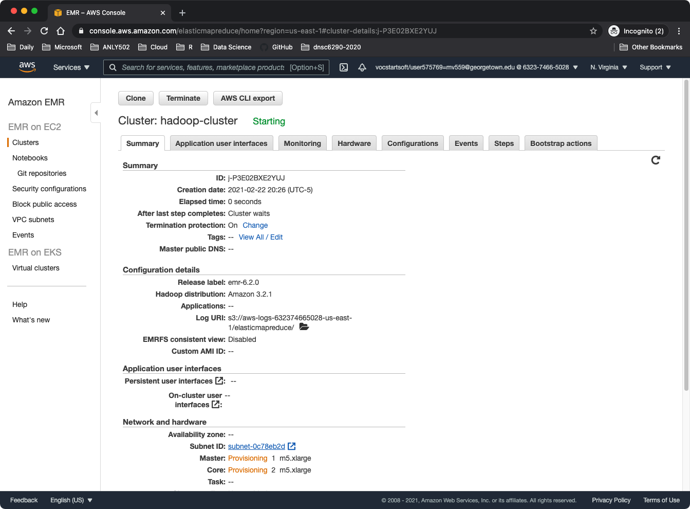

# Starting clusters on AWS Elastic MapReduce (EMR)

This guide will show you how to start two kinds of clusters:

* A cluster with with only Hadoop (used for the Hadoop Streaming lab and assignment)
* A cluster with Hadoop, Spark and special customizations which require a bootstrap action and other configutations. (called a Spark cluster and used for the rest of the course)

**Please follow the instructions and don't use the screenshots as a guide since screenshots can be outdated.**

## Starting a cluster with Hadoop only

You will use this section when working with Hadoop Streaming. If you need Spark, you must follow the directions in the Spark section.


Both files are included here for reference.


### Start: Go to the Elastic MapReduce (EMR) Console

1. From the _AWS Console home screen_, type `emr` in the search bar at the top, and click on EMR to go to the _EMR Console_

	

	This screen shows the _EMR Console_. Here you will see clusters that are running or that you created in the past.
	
	
	

### Step 1: Software and Steps

In this step, you will choose which tools and versions are going to be installed in your cluster.

1. From the EMR Console screen, click create cluster.
2. At the top of the _Create Cluster - Quick Options_ screen, click on the blue  **_Go to advanced Options_**

	

	#### For a **Hadoop Only** cluster
	
	a. Under _Software Configuration_ section, select `emr-6.2.0` from the drop-down and make sure that the **only these applications are selected**: 

	* Hadoop 3.2.1 
	* **Uncheck everything else**

	b. Click Next to go to Step 2


	#### For a **Spark** cluster
	
	a. Under _Software Configuration_ section, select `emr-6.2.0` from the drop-down and make sure that the **only these applications are selected**: 

	* Hadoop 3.2.1 
	* Spark 3.0.1
	* **Uncheck everything else**

	b. In the **_Edit software settings_** section, click on **_Load JSON from S3_**, and enter the following location in the box: `s3://bigdatateaching/bootstrap/cluster-config.json`

	

	c. Click Next to go to Step 2

### Step 2: Hardware

**Steps are the same for all clusters**

The size of the cluster in terms of number and size of nodes will be provided in each lab and activity separately.

1. Don't change any values in the _Hardware Configuration_, _Cluster Composition_, or _Networking_ sections
1. Scroll down to the _Cluster Nodes and Instances_ section
1. Edit the instance type of the _Master_ node if needed by clicking on the pencil. The number is 1 by default.
2. Edit the instance type of the _Core_ node if necessary and enter the number of core nodes recommended
1. Click Next tp go to Step 3

### Step 3: General Cluster Settings

1. Give the cluster a name that is meaningful to you

	#### For a **Hadoop Only** cluster
	
	a. Click Next to go to Step 4
	
	#### For a **Spark** cluster

	a. Towards the bottom of the screen, click on the triangle next to **_Bootstrap Actions_** to expand the section:

	

	b. In the **_Add bootstrap action_** dropdown, select **_Custom action_**
 and click on **_Configure and add_**
 
 	

	c. In the _Add Bootstrap Action_ dialog box, enter the following location in the _Script location_ section: `s3://bigdatateaching/bootstrap/bigdata-bootstrap.sh`
	
	Here is a summary of what this script does:

	* Installs Miniconda and Python3 on every node of the cluster, with many additional Python libraries
	* Installs and starts [JupyterLab](https://blog.jupyter.org/jupyterlab-is-ready-for-users-5a6f039b8906) automatically on port 8765, and you can use it for many repositories
	* Installs git
	* Downloads additional libraries needed for GraphX and GraphFrames
	* Tells YARN to allocate the most possible resources to Spark


	

	Make sure you see the custom action in the screen before you click next

	

	d. Click Next to go to Step 4

### Step 4. Security


**Steps are the same for all clusters**

1. Select your EC2 key-pair from the dropdown
2. Click **_Create cluster_**


## Cluster Startup

Once you click on _Create Cluster_, you will be taken to the cluster summary page where you will see all relevant information about the cluster

  
	
The cluster will go through several states until it is ready for you to use. 

1. Starting

	

2. Running

	

4. Waiting

	
  
  
**The startup time of clusters can vary from 5-10 minutes. You must wait until the cluster is in _Waiting_ state before you connect to it.**


## Edit Cluster Master Security Group (this is done only once)

The first time you create a cluster, you have to edit the Master Security group and open up port 22. The next time you start a cluster you do not have to do this again.

**Both Hadoop and Spark clusters use the same security group**

1. While the cluster is starting up, scroll down in the cluster summary page all the way to the bottom. 
2. Click on _Security groups for Master_
3. In the _Security Groups_ console, click on the group called `ElasticMapReduce-master`
4. Edit the inbound rules like you did in the cloud lab and add ssh port 22


## Connect to the cluster

1. Go to the EMR console and click on the cluster of interest which takes you to the cluster's summary page
2. Copy the _Master Public DNS_ from the Summary Section


	#### For a Hadoop only cluster
	
	a. Use ssh agent forwarding, so add your private key to memory using `ssh-add` (use the right approach based on your operating system.)
	b. `ssh` to the master node using the `hadoop` username and agent forwarding `-A`
	
	`ssh -A hadoop...` 

	c. You will see a login message:
	
	```
	       __|  __|_  )
	       _|  (     /   Amazon Linux 2 AMI
	      ___|\___|___|
	
	https://aws.amazon.com/amazon-linux-2/
	39 package(s) needed for security, out of 78 available
	Run "sudo yum update" to apply all updates.
	
	EEEEEEEEEEEEEEEEEEEE MMMMMMMM           MMMMMMMM RRRRRRRRRRRRRRR
	E::::::::::::::::::E M:::::::M         M:::::::M R::::::::::::::R
	EE:::::EEEEEEEEE:::E M::::::::M       M::::::::M R:::::RRRRRR:::::R
	  E::::E       EEEEE M:::::::::M     M:::::::::M RR::::R      R::::R
	  E::::E             M::::::M:::M   M:::M::::::M   R:::R      R::::R
	  E:::::EEEEEEEEEE   M:::::M M:::M M:::M M:::::M   R:::RRRRRR:::::R
	  E::::::::::::::E   M:::::M  M:::M:::M  M:::::M   R:::::::::::RR
	  E:::::EEEEEEEEEE   M:::::M   M:::::M   M:::::M   R:::RRRRRR::::R
	  E::::E             M:::::M    M:::M    M:::::M   R:::R      R::::R
	  E::::E       EEEEE M:::::M     MMM     M:::::M   R:::R      R::::R
	EE:::::EEEEEEEE::::E M:::::M             M:::::M   R:::R      R::::R
	E::::::::::::::::::E M:::::M             M:::::M RR::::R      R::::R
	EEEEEEEEEEEEEEEEEEEE MMMMMMM             MMMMMMM RRRRRRR      RRRRRR
	```

	d. Install and configure `git`

	#### For a Spark cluster
	
	a. Use ssh agent forwarding, so add your private key to memory using `ssh-add` (use the right approach based on your operating system.)
	b. `ssh` to the master node using the `hadoop` username, agent forwarding `-A` and local port forwarding `-L`
	
	`ssh -A -L 8765:localhost:8765 hadoop@...` 

	c. You will see an _updated_ login message:


	``` 
	EEEEEEEEEEEEEEEEEEEE MMMMMMMM           MMMMMMMM RRRRRRRRRRRRRRR
	E::::::::::::::::::E M:::::::M         M:::::::M R::::::::::::::R
	EE:::::EEEEEEEEE:::E M::::::::M       M::::::::M R:::::RRRRRR:::::R
	  E::::E       EEEEE M:::::::::M     M:::::::::M RR::::R      R::::R
	  E::::E             M::::::M:::M   M:::M::::::M   R:::R      R::::R
	  E:::::EEEEEEEEEE   M:::::M M:::M M:::M M:::::M   R:::RRRRRR:::::R
	  E::::::::::::::E   M:::::M  M:::M:::M  M:::::M   R:::::::::::RR
	  E:::::EEEEEEEEEE   M:::::M   M:::::M   M:::::M   R:::RRRRRR::::R
	  E::::E             M:::::M    M:::M    M:::::M   R:::R      R::::R
	  E::::E       EEEEE M:::::M     MMM     M:::::M   R:::R      R::::R
	EE:::::EEEEEEEE::::E M:::::M             M:::::M   R:::R      R::::R
	E::::::::::::::::::E M:::::M             M:::::M RR::::R      R::::R
	EEEEEEEEEEEEEEEEEEEE MMMMMMM             MMMMMMM RRRRRRR      RRRRRR
	
	Your Big Data Cluster is Ready! You are logged into the master node.
	
	Git is installed and Jupyter Lab is running in port 8765. You are
	now able to clone multiple repositories and see them in a single
	Jupyter session. There is not need to manually run a script.
	
	To access Jupyter make sure you connect to the cluster with port
	forwarding, and ssh-agent if necessary. If you did not, type exit
	to log out and then log back in:
	
	ssh -A -L8765:localhost:8765 hadoop@...
	and then open a web browser on your laptop and go to
	http://localhost:8765
	
	Remember to configure your git settings (every time you create a
	cluster. You only need to do this once.
	
	git config --global user.name "[[your name]]"
	git config --global user.email [[your email]]
	
	Have fun!
	--------------------------------------------------------------------
	```

	d. Change the `git` configuration settings to your name and email.

	e. Open a browser and navigate to [http://localhost:8765](http://localhost:8765) to see your Jupyter Lab environment.

